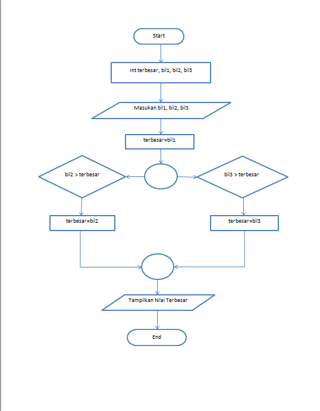
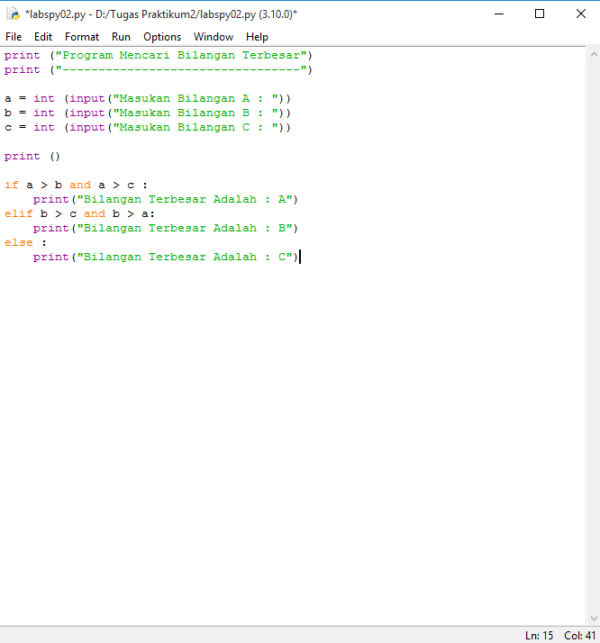
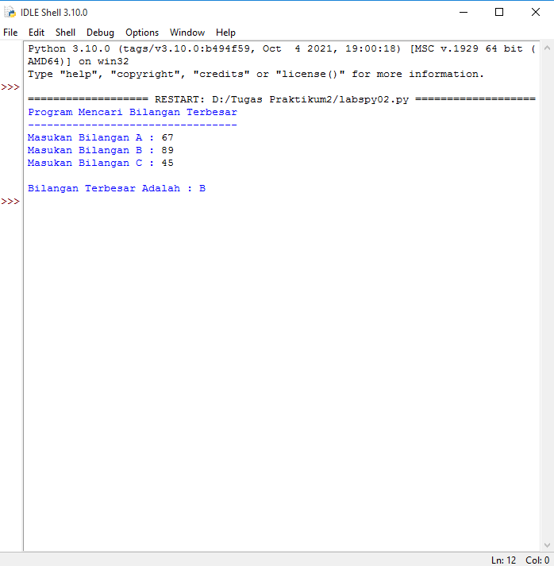

# labspy02

## Tugas Praktikum 2
- Membuat program sederhana dengan input tiga buah bilangan, dari ketiga bilangan tersebut tampilkan bilangan terbesarnya. 

#### Flowchart

#### Program

#### Output

## Terima kasih